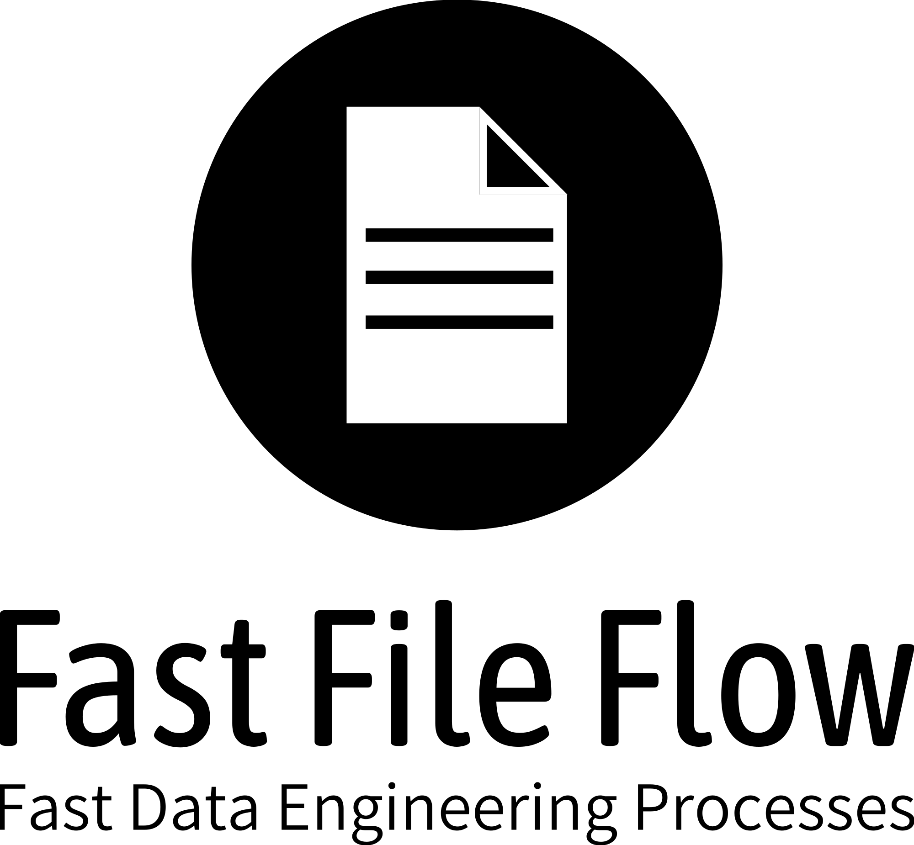

# Fast File Flow

A Rust-based GUI desktop application for data engineering tasks. Fast File Flow provides a visual interface for loading, filtering, processing, and analyzing CSV/JSON files with integrated machine learning capabilities.

<p>

</p>

## Features

### 📁 File Support
- **CSV Files**: Load and process CSV files with automatic encoding detection
- **JSON Files**: Basic JSON file support via serde
- **Custom Format**: `.ffflow` project files for saving application state
- **Export**: Export processed data to timestamped files in `./output/`

### 📊 Data Visualization
- **Interactive Table View**: Scrollable data grid with resizable columns
- **Column Statistics**: Automatic data classification (Qualitative/Quantitative)
- **Correlation Analysis**: Analyze relationships between columns
- **Real-time Preview**: Preview filtered/processed data before exporting

### 🤖 Machine Learning (via Linfa)
Fast File Flow integrates the `linfa` ML library for data analysis:

| Algorithm | Description |
|-----------|-------------|
| **K-Means Clustering** | Unsupervised clustering with centroid visualization |
| **PCA** | Principal Component Analysis for dimensionality reduction |
| **DBSCAN** | Density-based spatial clustering for noise detection |
| **Linear Regression** | Predictive modeling with regression coefficients |

All ML models generate PNG visualization charts saved to `./output/`.

### 🔧 Data Processing
- **Filter Options**: Filter data by column values with multiple conditions
- **Process Options**: Apply transformations to data columns
- **Column Selection**: Choose which columns to include/exclude
- **Search**: Full-text search within loaded data

### 💾 Project Management
- **Save Project**: Save current state as `.ffflow` files
- **Load Project**: Resume work from saved projects
- **Configuration**: `config.ffflow` stores last loaded file and column settings

## Architecture

The application follows an **Elm-style architecture** using the Iced GUI framework:

```
Model → Update → View
```

### Core Components

| Module | Purpose |
|--------|---------|
| `fast_file_flow/` | Main application state, message handling, view rendering |
| `stored_file/` | File loading, column/row storage, data access |
| `ai/` | ML analysis: K-Means, PCA, DBSCAN, Linear Regression |
| `dynamictable/` | Table UI components (columns, rows, scrollable views) |
| `stadistics/` | Statistical analysis and data classification |
| `save_options/` | Filter and process options for data export |
| `correlation_analysis/` | Correlation calculations between columns |

### Data Flow
1. File selected → `StoredFile::new()` async loads columns and first 50 rows
2. Full columns loaded on-demand via `StoredFile::get_full_column()` for ML/statistics
3. ML operations return results as images/text
4. Export generates timestamped files in `./output/`

## Tech Stack

- **GUI Framework**: [Iced 0.12](https://iced.rs/) - Elm-inspired Rust GUI framework
- **Async Runtime**: [Tokio](https://tokio.rs/) - For non-blocking file I/O
- **CSV Parsing**: [csv-async](https://docs.rs/csv-async/) - Async CSV reading/writing
- **Machine Learning**: [Linfa](https://rust-ml.github.io/linfa/) - Rust ML toolkit
  - `linfa-clustering` - K-Means, DBSCAN
  - `linfa-linear` - Linear Regression
  - `linfa-reduction` - PCA
- **Numerical Computing**: [ndarray](https://docs.rs/ndarray/) + [Rayon](https://github.com/rayon-rs/rayon) for parallelization
- **Visualization**: [plotters](https://plotters-rs.github.io/) - Chart/plot generation
- **Image Processing**: [image](https://docs.rs/image/) - Image handling

## Installation

### Prerequisites
- [Rust](https://www.rust-lang.org/tools/install) (latest stable version)
- Windows, macOS, or Linux

### Build from Source

```bash
# Clone the repository
git clone https://github.com/bymarcogr/fast_file_flow.git
cd fast_file_flow

# Build the project
cargo build --release

# Run in development mode
cargo run
```

## Usage

### Quick Start

1. **Launch the application**:
   ```bash
   cargo run
   ```

2. **Load a file**: Click the folder icon to open a CSV or JSON file

3. **Explore data**: View your data in the interactive table

4. **Apply filters**: Use the filter panel to narrow down data

5. **Run ML analysis**: Go to the AI panel and select an algorithm

6. **Export results**: Save processed data to `./output/`

### Keyboard Shortcuts

| Shortcut | Action |
|----------|--------|
| File operations | Via menu buttons |
| Navigation | Click panel icons |

### Project Files

Save your work as `.ffflow` files to preserve:
- Loaded file path
- Column selections
- Filter/processing settings
- Application state

## Development

### Project Structure

```
fast_file_flow/
├── src/
│   ├── ai/                    # ML algorithms
│   │   ├── dbscan/
│   │   ├── k_means/
│   │   ├── linear_regression/
│   │   ├── pca/
│   │   └── shared/
│   ├── constants/             # App constants (sizes, paths, text)
│   ├── correlation_analysis/
│   ├── dialog/                # File dialogs
│   ├── dynamictable/          # Table UI components
│   ├── export/                # File export logic
│   ├── fast_file_flow/        # Main app (state, messages, view)
│   ├── save_options/          # Filter/process options
│   ├── stadistics/            # Statistical analysis
│   ├── stored_file/           # File loading/storage
│   ├── util/                  # Utility functions
│   ├── lib.rs
│   └── main.rs
├── src/resources/
│   ├── fonts/                 # Custom icon font
│   └── images/                # App icons and logos
├── Cargo.toml
└── README.md
```

### Build Commands

```bash
# Build the project
cargo build

# Run in development
cargo run

# Build release version
cargo build --release

# Check for compile errors without building
cargo check

# Clean build artifacts
cargo clean
```

### Configuration

- **Window size**: Fixed at 1200x800 (APP_WIDTH x APP_HEIGHT in constants)
- **Custom font**: `src/resources/fonts/iced-fff.ttf`
- **Output directory**: `./output/`
- **Config file**: `config.ffflow`

## Roadmap

### Version 1.0 (Current)
- [x] CSV/JSON file loading
- [x] Interactive data table
- [x] Column filtering and processing
- [x] K-Means clustering
- [x] PCA analysis
- [x] DBSCAN clustering
- [x] Linear Regression
- [x] Project save/load
- [x] Data export

### Future Enhancements
- [ ] Additional ML algorithms (SVM, Decision Trees)
- [ ] Data transformation pipelines
- [ ] Plugin system for custom processors
- [ ] Cloud storage integration
- [ ] Real-time data streaming
- [ ] Advanced visualization options
- [ ] Support for CSV files using ';' as field separator to improve compatibility with regional data formats
- [ ] Performance optimizations for handling large datasets using Rust concurrency and parallel processing
- [ ] Enhanced correlation analysis with automatic handling of missing values
- [ ] Processing time indicator in the UI status bar to show execution time of data preparation operations
- [ ] Missing data counter per column to help identify data quality issues
- [ ] Sensitive data anonymization module for protecting personal or confidential information
- [ ] Automatic column generation based on user-defined rules, calculations, or transformations
- [ ] Automatic data type detection and schema inference for structured datasets (AI)
- [ ] Outlier detection using statistical and machine learning techniques to improve data quality analysis (AI)
- [ ] Automatic feature engineering suggestions based on dataset characteristics (AI)
- [ ] Smart data cleaning recommendations using pattern recognition and anomaly detection (AI)
- [ ] Natural language querying to allow users to explore datasets using plain language commands (AI)

## Contributing

Contributions are welcome! Please feel free to submit a Pull Request.

1. Fork the repository
2. Create your feature branch (`git checkout -b feature/AmazingFeature`)
3. Commit your changes (`git commit -m 'Add some AmazingFeature'`)
4. Push to the branch (`git push origin feature/AmazingFeature`)
5. Open a Pull Request

## License

This project is licensed under the MIT License - see the LICENSE file for details.

## Acknowledgments

- [Iced](https://iced.rs/) - The fantastic Rust GUI framework
- [Linfa](https://rust-ml.github.io/linfa/) - Rust's machine learning toolkit
- [Tokio](https://tokio.rs/) - Asynchronous runtime for Rust
- [Plotters](https://plotters-rs.github.io/) - Rust visualization library

## Support

For issues, questions, or feature requests, please open an issue on GitHub.

---

**Made with Rust 🦀 and Iced**